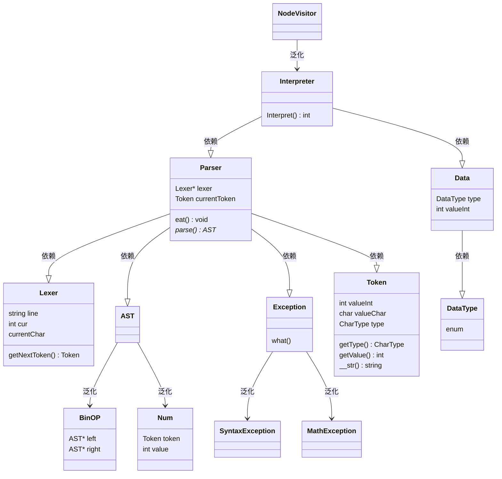
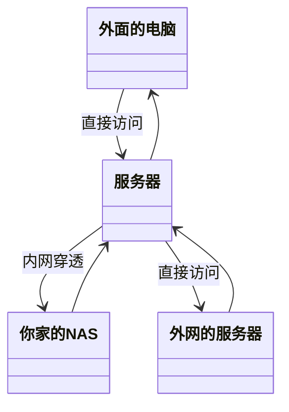

<!--
 * @Author: your name
 * @Date: 1970-01-01 08:00:00
 * @LastEditTime: 2020-04-18 16:43:19
 * @Description: file content
 -->
##Interpreter Classes map
#####Main
```
| -----Lexer
|        |
|        -------------------------------
|        |         |         |         |
|     advance    skipwb   integer  nextToken
|
| -----Parser
|        |
|        -------------------------------
|        |     |       |      |       |
|       eat  factor-->term-->expr   prase
|
| -----Interpreter
|        |
|       ---
|        |
|    Interpreter
| (Post-Order Traversal)
|
```
#####Basic structure
```
    AST

    BinOp(Binary tree,using operator as root)
    Num(Terminal)
```
#####Tool
```
    Exception
    Token
```


<br>
<br>
<br>
<br>
<br>
<br>
<br>
<br>
<br>
<br>


